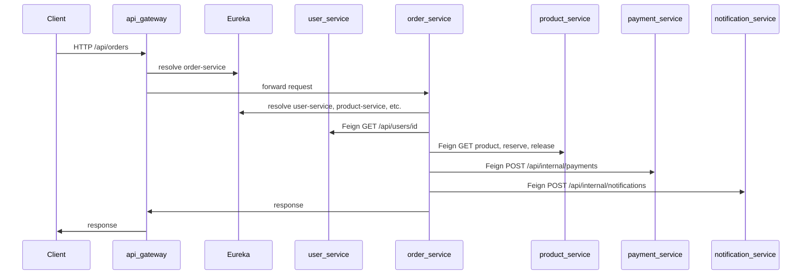
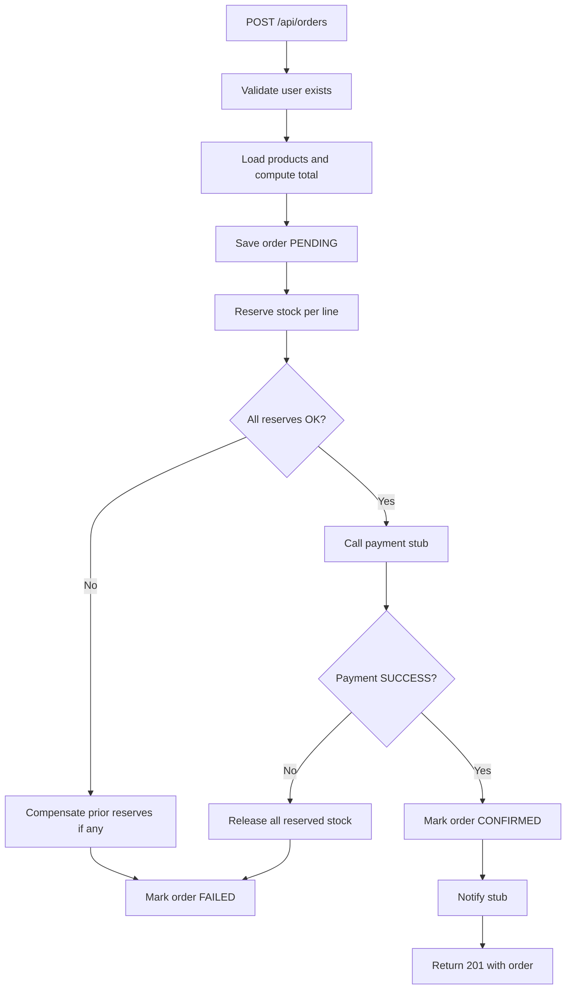

# End-to-end flow

This document describes how traffic and business logic move through the e-commerce microservices MVP: from the client through the API gateway, service discovery, and the order workflow that coordinates multiple services.

## Components and ports

| Component | Port | Role |
|-----------|------|------|
| Eureka Server | 8761 | Service registry; other apps register here so the gateway and Feign clients can resolve `lb://service-name`. |
| API Gateway | 8080 | Single entry for public HTTP APIs (`/api/users`, `/api/products`, `/api/orders`). Routes by path to the correct service via load-balanced discovery. |
| user-service | 8081 | User CRUD; default in-memory **H2**, optional local **PostgreSQL** (profile `local`). |
| product-service | 8082 | Product CRUD and internal stock **reserve** / **release**; same storage options as user-service. |
| payment-service | 8083 | Stub payment API (not routed through the gateway). |
| notification-service | 8084 | Stub notifications (log only; not routed through the gateway). |
| order-service | 8085 | Order persistence and **orchestration** (calls other services with Feign); same storage options as user-service. |

**Client-facing base URL:** `http://localhost:8080` (always go through the gateway for user, product, and order APIs).

### Local PostgreSQL (optional)

To use a real database on your machine (for example with **DBeaver**), start Postgres via Docker and run the three JPA services with `SPRING_PROFILES_ACTIVE=local`. Step-by-step instructions: [local-postgres.md](local-postgres.md).

## Startup order

1. Start **Eureka** first so the registry is available.
2. Start **user-service**, **product-service**, **payment-service**, **notification-service**, and **order-service** (order among these does not matter; they retry registration).
3. Start **api-gateway** last or after Eureka; it must see registered services for `lb://` routes to work.

If the gateway starts before downstream services, routes may fail until those services register.

Step-by-step checklist (Eureka + gateway + optional Postgres): [run-option-a.md](run-option-a.md).

## Discovery and routing

1. Each microservice registers with Eureka using `spring.application.name` (for example `user-service`, `order-service`).
2. The gateway declares routes such as `Path=/api/users/**` → `uri: lb://user-service`. Spring Cloud LoadBalancer resolves `user-service` via Eureka to concrete instances.
3. **order-service** does not receive browser traffic for payments or notifications. It calls **payment-service** and **notification-service** using Feign with the same logical names (`payment-service`, `notification-service`), so those calls also go through Eureka load balancing.



## Public API vs internal API

- **Through gateway (8080):**  
  - `/api/users/**` → user-service  
  - `/api/products/**` → product-service  
  - `/api/orders/**` → order-service  

- **Not exposed on the gateway (service-to-service only):**  
  - `product-service`: `/api/internal/products/{id}/reserve` and `.../release` (called by order-service).  
  - `payment-service`: `/api/internal/payments`.  
  - `notification-service`: `/api/internal/notifications`.  

That keeps payment and notification entry points off the public edge; only **order-service** orchestrates them.

## End-to-end: create a user

1. Client sends `POST http://localhost:8080/api/users` with JSON body `email`, `name`.
2. Gateway matches `/api/users/**` and forwards to **user-service**.
3. user-service validates input, saves a `User` in H2, returns the created user (for example with `id`).

No other service is involved.

## End-to-end: create a product

1. Client sends `POST http://localhost:8080/api/products` with `name`, `description`, `price`, `stock`.
2. Gateway forwards to **product-service**.
3. product-service saves a `Product` and returns it (including `id` and `stock`).

## End-to-end: place an order (main flow)

This is the full orchestration path.

### 1. Request from the client

`POST http://localhost:8080/api/orders` with JSON like:

```json
{
  "userId": 1,
  "items": [
    { "productId": 1, "quantity": 2 }
  ],
  "failPayment": false
}
```

- `failPayment` is optional; if `true`, the payment stub is called in a way that forces failure so you can observe rollback (see below).

### 2. Gateway → order-service

The gateway routes to **order-service**, which runs `OrderPlacementService.placeOrder`.

### 3. Validate user

- **Feign** `GET http://user-service/api/users/{userId}` (via Eureka).
- If the user does not exist (404), the client receives an error and **no order** is persisted.

### 4. Price the order

- For each line item, **Feign** `GET /api/products/{productId}` on **product-service**.
- Line totals = `price × quantity`; order total = sum of line totals.
- If a product is missing (404), the client receives an error and **no order** is persisted yet.

### 5. Persist order (pending)

- order-service saves an **Order** and **OrderLine** rows in its own H2 DB with status **PENDING**.

### 6. Reserve stock

- For each line, **Feign** `POST /api/internal/products/{id}/reserve` with body `{ "quantity": n }`.
- product-service decrements stock (with optimistic locking on `Product`). If stock is insufficient, it responds with **409 Conflict**; order-service then fails the flow (see compensation).

### 7. Payment (stub)

- **Feign** `POST /api/internal/payments` with `{ "orderId", "amount" }` and optional query `fail=true` (order-service sets this when `failPayment` is true).
- payment-service returns `SUCCESS` or `FAILED` without charging a real card. In this MVP, amounts above a high threshold or `fail=true` yield **FAILED**.

### 8. Success path

- Order status is set to **CONFIRMED** and saved.
- **Feign** `POST /api/internal/notifications` with `{ "orderId", "event": "ORDER_CONFIRMED" }`. notification-service logs and returns **202**; failures are logged by order-service but do **not** roll back a confirmed order.

### 9. Failure and compensation

- If **reservation** or **payment** fails (or a Feign error occurs after reservations succeeded), order-service:
  - Calls **release** on product-service for each reserved line (reverse order), to put stock back.
  - Sets order status to **FAILED** in the order database.
- The API response reflects the failure (for example bad gateway or bad request, depending on the case).

### 10. Response to the client

- On success: **201** with order details (id, status **CONFIRMED**, lines, total).
- On failure: appropriate HTTP status after compensation and order marked **FAILED** where applicable.

## Summary diagram (order only)



## Optional checks

- **Health:** Each service exposes Spring Boot Actuator (for example `/actuator/health`) on its own port for readiness checks.
- **Eureka UI:** Open `http://localhost:8761` to see which service instances are registered.

This file describes the behavior implemented in the repository; adjust ports or paths if you change `application.yml` or gateway routes.
